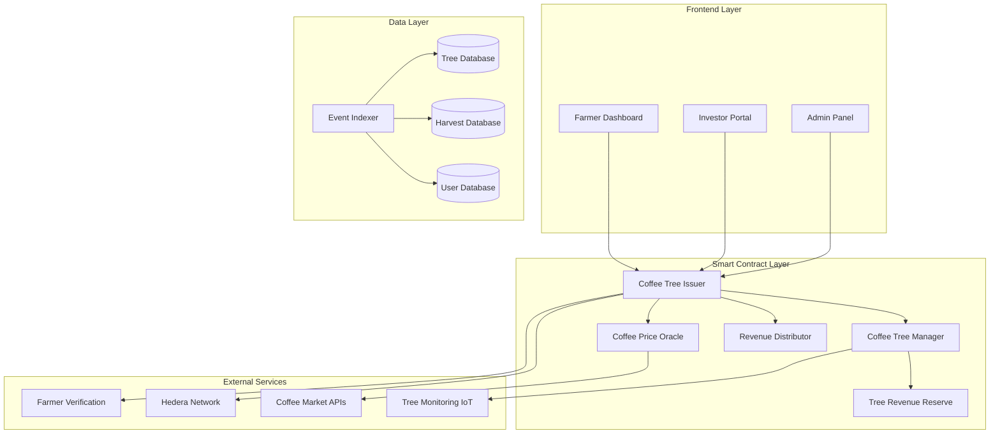

# Design Document

## Overview

The coffee tree tokenization platform leverages the existing Hedera-based DeFi infrastructure to create a revolutionary agricultural investment system. By adapting the current tokenized asset framework, we transform coffee trees into tradeable digital assets that provide farmers with upfront capital while offering investors transparent, yield-generating investments backed by real coffee production.

The system maintains the proven architecture of the existing platform while introducing coffee-specific functionality including farmer verification, harvest reporting, revenue distribution, and tree health monitoring.

## Architecture

### High-Level System Architecture



### Contract Architecture Adaptation

The existing contracts will be adapted as follows:

1. **Issuer.sol** → **CoffeeTreeIssuer.sol**: Manages coffee tree tokenization and trading
2. **TokenizedAssetManager.sol** → **CoffeeTreeManager.sol**: Handles individual coffee tree token operations
3. **Reserve.sol** → **CoffeeRevenueReserve.sol**: Manages revenue collection and distribution
4. **PriceOracle.sol** → **CoffeePriceOracle.sol**: Provides coffee market pricing data
5. **Lender.sol** → **RevenueDistributor.sol**: Handles automatic revenue sharing

## Components and Interfaces

### 1. CoffeeTreeIssuer Contract

**Purpose**: Main contract for coffee tree tokenization and management

**Key Functions**:
```solidity
// Farmer Operations
function registerCoffeeGrove(
    string memory groveName,
    string memory location,
    uint64 treeCount,
    string memory coffeeVariety,
    uint64 expectedYieldPerTree
) external onlyVerifiedFarmer

function tokenizeCoffeeGrove(
    string memory groveName,
    uint64 tokensPerTree,
    uint64 pricePerToken
) external onlyGroveOwner

// Investor Operations
function purchaseTreeTokens(
    string memory groveName,
    uint64 tokenAmount
) external payable

function sellTreeTokens(
    string memory groveName,
    uint64 tokenAmount
) external

// Revenue Operations
function reportHarvest(
    string memory groveName,
    uint64 totalYieldKg,
    uint64 qualityGrade,
    uint64 salePrice
) external onlyGroveOwner

function distributeRevenue(
    string memory groveName
) external
```

**Events**:
```solidity
event CoffeeGroveRegistered(bytes32 indexed groveName, address indexed farmer, uint64 treeCount);
event TreeTokensPurchased(address indexed grove, uint64 indexed amount, address indexed investor);
event HarvestReported(bytes32 indexed groveName, uint64 yield, uint64 revenue);
event RevenueDistributed(bytes32 indexed groveName, uint64 totalRevenue, uint256 timestamp);
```

### 2. CoffeeTreeManager Contract

**Purpose**: Manages individual coffee tree token operations and metadata

**Key Functions**:
```solidity
function createTreeToken(
    string memory groveName,
    string memory symbol,
    uint64 totalSupply,
    TreeMetadata memory metadata
) external returns (address)

function updateTreeHealth(
    uint8 healthScore,
    string memory notes
) external onlyFarmer

function getTreeMetadata() external view returns (TreeMetadata memory)

function airdropRevenueTokens(
    address[] memory holders,
    uint64[] memory amounts
) external onlyRevenueDistributor
```

**Data Structures**:
```solidity
struct TreeMetadata {
    string location;
    string coffeeVariety;
    uint64 plantingDate;
    uint64 expectedYieldPerSeason;
    uint8 currentHealthScore;
    string farmingPractices;
}

struct HarvestRecord {
    uint64 harvestDate;
    uint64 yieldKg;
    uint64 qualityGrade;
    uint64 salePrice;
    bool revenueDistributed;
}
```

### 3. CoffeeRevenueReserve Contract

**Purpose**: Manages revenue collection and automatic distribution to token holders

**Key Functions**:
```solidity
function depositHarvestRevenue(
    uint64 amount,
    bytes32 harvestId
) external onlyGroveManager

function calculateTokenHolderShares(
    address groveToken
) external view returns (address[] memory holders, uint64[] memory shares)

function distributeRevenue(
    address groveToken,
    uint64 totalRevenue
) external onlyAuthorized

function withdrawFarmerShare(
    uint64 amount
) external onlyGroveOwner
```

### 4. CoffeePriceOracle Contract

**Purpose**: Provides real-time coffee market pricing and yield projections

**Key Functions**:
```solidity
function updateCoffeePrice(
    string memory coffeeGrade,
    uint64 pricePerKg
) external onlyPriceFeeder

function getCoffeePrice(
    string memory coffeeGrade
) external view returns (uint64)

function calculateProjectedRevenue(
    address groveToken,
    uint64 expectedYield
) external view returns (uint64)

function updateSeasonalMultiplier(
    uint8 month,
    uint64 multiplier
) external onlyAdmin
```

### 5. FarmerVerification Contract

**Purpose**: Manages farmer identity verification and grove ownership validation

**Key Functions**:
```solidity
function submitVerificationDocuments(
    string memory documentsHash,
    string memory location,
    uint64[] memory coordinates
) external

function verifyFarmer(
    address farmer,
    bool approved
) external onlyVerifier

function isVerifiedFarmer(
    address farmer
) external view returns (bool)

function registerGroveOwnership(
    address farmer,
    string memory groveName,
    string memory ownershipProof
) external onlyVerifier
```

## Data Models

### Database Schema

```sql
-- Coffee Groves
CREATE TABLE coffee_groves (
    id INTEGER PRIMARY KEY,
    grove_name TEXT UNIQUE NOT NULL,
    farmer_address TEXT NOT NULL,
    token_address TEXT UNIQUE,
    location TEXT NOT NULL,
    coordinates_lat REAL,
    coordinates_lng REAL,
    tree_count INTEGER NOT NULL,
    coffee_variety TEXT NOT NULL,
    planting_date INTEGER,
    expected_yield_per_tree INTEGER,
    total_tokens_issued INTEGER,
    tokens_per_tree INTEGER,
    verification_status TEXT DEFAULT 'pending',
    created_at INTEGER DEFAULT (strftime('%s', 'now')),
    updated_at INTEGER DEFAULT (strftime('%s', 'now'))
);

-- Harvest Records
CREATE TABLE harvest_records (
    id INTEGER PRIMARY KEY,
    grove_id INTEGER NOT NULL,
    harvest_date INTEGER NOT NULL,
    yield_kg INTEGER NOT NULL,
    quality_grade INTEGER NOT NULL,
    sale_price_per_kg INTEGER NOT NULL,
    total_revenue INTEGER NOT NULL,
    farmer_share INTEGER NOT NULL,
    investor_share INTEGER NOT NULL,
    revenue_distributed BOOLEAN DEFAULT FALSE,
    transaction_hash TEXT,
    created_at INTEGER DEFAULT (strftime('%s', 'now')),
    FOREIGN KEY (grove_id) REFERENCES coffee_groves (id)
);

-- Token Holdings
CREATE TABLE token_holdings (
    id INTEGER PRIMARY KEY,
    holder_address TEXT NOT NULL,
    grove_id INTEGER NOT NULL,
    token_amount INTEGER NOT NULL,
    purchase_price INTEGER NOT NULL,
    purchase_date INTEGER NOT NULL,
    is_active BOOLEAN DEFAULT TRUE,
    FOREIGN KEY (grove_id) REFERENCES coffee_groves (id)
);

-- Revenue Distributions
CREATE TABLE revenue_distributions (
    id INTEGER PRIMARY KEY,
    harvest_id INTEGER NOT NULL,
    holder_address TEXT NOT NULL,
    token_amount INTEGER NOT NULL,
    revenue_share INTEGER NOT NULL,
    distribution_date INTEGER NOT NULL,
    transaction_hash TEXT,
    FOREIGN KEY (harvest_id) REFERENCES harvest_records (id)
);

-- Farmer Verification
CREATE TABLE farmer_verifications (
    id INTEGER PRIMARY KEY,
    farmer_address TEXT UNIQUE NOT NULL,
    verification_status TEXT DEFAULT 'pending',
    documents_hash TEXT,
    verifier_address TEXT,
    verification_date INTEGER,
    rejection_reason TEXT,
    created_at INTEGER DEFAULT (strftime('%s', 'now'))
);
```

### TypeScript Interfaces

```typescript
interface CoffeeGrove {
  id: string;
  groveName: string;
  farmerAddress: string;
  tokenAddress?: string;
  location: string;
  coordinates: {
    lat: number;
    lng: number;
  };
  treeCount: number;
  coffeeVariety: string;
  plantingDate: Date;
  expectedYieldPerTree: number;
  totalTokensIssued: number;
  tokensPerTree: number;
  verificationStatus: 'pending' | 'verified' | 'rejected';
  currentHealthScore?: number;
}

interface HarvestRecord {
  id: string;
  groveId: string;
  harvestDate: Date;
  yieldKg: number;
  qualityGrade: number;
  salePricePerKg: number;
  totalRevenue: number;
  farmerShare: number;
  investorShare: number;
  revenueDistributed: boolean;
  transactionHash?: string;
}

interface TokenHolding {
  id: string;
  holderAddress: string;
  groveId: string;
  tokenAmount: number;
  purchasePrice: number;
  purchaseDate: Date;
  currentValue: number;
  projectedAnnualReturn: number;
}

interface RevenueDistribution {
  id: string;
  harvestId: string;
  holderAddress: string;
  tokenAmount: number;
  revenueShare: number;
  distributionDate: Date;
  transactionHash: string;
}
```

## Error Handling

### Smart Contract Error Handling

```solidity
// Custom Errors
error UnverifiedFarmer(address farmer);
error InsufficientTokens(uint64 requested, uint64 available);
error InvalidHarvestData(string reason);
error RevenueAlreadyDistributed(bytes32 harvestId);
error GroveNotFound(string groveName);
error UnauthorizedAccess(address caller);

// Error Handling Patterns
modifier onlyVerifiedFarmer() {
    if (!farmerVerification.isVerifiedFarmer(msg.sender)) {
        revert UnverifiedFarmer(msg.sender);
    }
    _;
}

function purchaseTreeTokens(string memory groveName, uint64 amount) external {
    CoffeeTreeManager grove = coffeeGroves[groveName];
    if (address(grove) == address(0)) {
        revert GroveNotFound(groveName);
    }
    
    uint64 availableTokens = grove.getAvailableTokens();
    if (amount > availableTokens) {
        revert InsufficientTokens(amount, availableTokens);
    }
    
    // Continue with purchase logic...
}
```

### Application Error Handling

```typescript
class CoffeeTreeService {
  async purchaseTreeTokens(groveName: string, amount: number): Promise<TransactionResult> {
    try {
      // Validate inputs
      if (amount <= 0) {
        throw new ValidationError('Token amount must be positive');
      }
      
      // Check grove exists
      const grove = await this.getGrove(groveName);
      if (!grove) {
        throw new NotFoundError(`Grove ${groveName} not found`);
      }
      
      // Execute transaction
      const tx = await this.executeTransaction('purchaseTreeTokens', [groveName, amount]);
      
      return {
        success: true,
        transactionHash: tx.hash,
        message: `Successfully purchased ${amount} tree tokens`
      };
      
    } catch (error) {
      if (error instanceof ContractError) {
        return this.handleContractError(error);
      }
      
      logger.error('Unexpected error in purchaseTreeTokens', error);
      return {
        success: false,
        error: 'An unexpected error occurred. Please try again.'
      };
    }
  }
  
  private handleContractError(error: ContractError): TransactionResult {
    switch (error.code) {
      case 'UnverifiedFarmer':
        return { success: false, error: 'Farmer verification required' };
      case 'InsufficientTokens':
        return { success: false, error: 'Not enough tokens available for purchase' };
      case 'InvalidHarvestData':
        return { success: false, error: 'Invalid harvest data provided' };
      default:
        return { success: false, error: 'Transaction failed. Please try again.' };
    }
  }
}
```

## Testing Strategy

### Unit Testing

```typescript
describe('CoffeeTreeIssuer', () => {
  describe('registerCoffeeGrove', () => {
    it('should allow verified farmers to register groves', async () => {
      // Setup verified farmer
      await farmerVerification.verifyFarmer(farmer.address, true);
      
      // Register grove
      const tx = await coffeeIssuer.registerCoffeeGrove(
        'Test Grove',
        'Costa Rica',
        100,
        'Arabica',
        5000
      );
      
      expect(tx).to.emit(coffeeIssuer, 'CoffeeGroveRegistered');
    });
    
    it('should reject unverified farmers', async () => {
      await expect(
        coffeeIssuer.registerCoffeeGrove('Test Grove', 'Costa Rica', 100, 'Arabica', 5000)
      ).to.be.revertedWithCustomError(coffeeIssuer, 'UnverifiedFarmer');
    });
  });
  
  describe('revenue distribution', () => {
    it('should distribute revenue proportionally to token holders', async () => {
      // Setup grove with multiple investors
      // Report harvest
      // Verify distribution amounts
    });
  });
});
```

### Integration Testing

```typescript
describe('Coffee Tree Platform Integration', () => {
  it('should handle complete farmer-to-investor flow', async () => {
    // 1. Farmer verification
    // 2. Grove registration
    // 3. Tree tokenization
    // 4. Investor purchases
    // 5. Harvest reporting
    // 6. Revenue distribution
    // 7. Verify all balances and events
  });
  
  it('should handle secondary market trading', async () => {
    // Test token trading between investors
  });
});
```

### Performance Testing

- **Load Testing**: Simulate multiple concurrent purchases and revenue distributions
- **Gas Optimization**: Ensure efficient contract execution for large token holder lists
- **Database Performance**: Test query performance with large datasets of groves and transactions

### Security Testing

- **Access Control**: Verify only authorized users can perform sensitive operations
- **Reentrancy Protection**: Ensure revenue distribution is protected against reentrancy attacks
- **Input Validation**: Test all contract functions with invalid inputs
- **Economic Attacks**: Test scenarios where malicious actors try to manipulate revenue distributions

This design maintains the robust foundation of the existing platform while introducing the specialized functionality needed for coffee tree tokenization. The modular architecture allows for easy extension and maintenance while ensuring security and scalability.